# テキスト小説用拡張機能

小説を執筆しながらリアルタイムに縦書きプレビューできる機能とルビの入力をサポートする拡張機能です。 
テキストの形式は「小説家になろう」形式と「青空文庫」形式の２つをサポートしています。

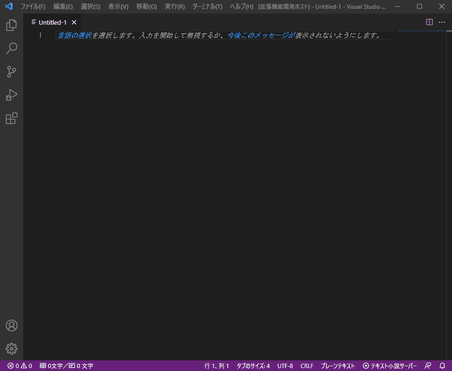

## 使い方

### 1. 言語モードの選択
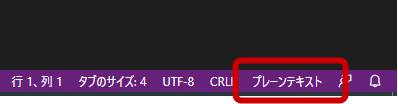

「小説家になろう」、「青空文庫」形式のどちらかを選択

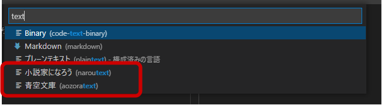

### 2. 本文の作成
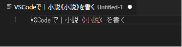
#### ルビ・傍点の入力補助

テキストを選択して、「ルビを振る」・「傍点を振る」機能を使用すると各モードに合わせて入力が補完されます。 
ルビを振りたい文字を選択して、右上のアイコンをクリックすると各モードに合わせたルビの記号が挿入されます。 
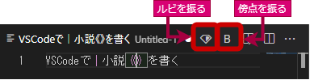

##### ルビ一覧
| 機能 | 説明 |
| ---- | ---- |
|ルビの抽出|「ワークスペース」内のテキストファイルからルビを抽出して一覧にできます。|
|ルビの一覧を出力|ルビの一覧をテキストファイルに出力できます。|

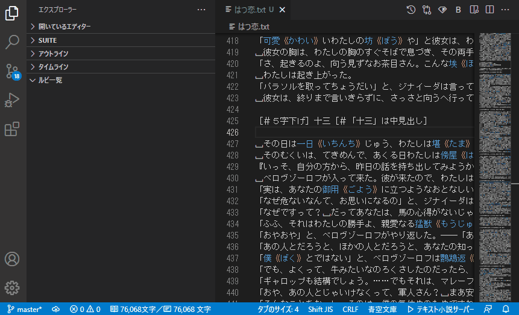

##### ルビの候補
《》内でCtrl+スペースキーを押下することで一度入力したルビが候補としてポップアップに表示されます。 
※候補は「ルビ一覧」に表示されているものが対象となります。 
ルビ一覧を最新にする場合は「ルビの抽出」を実行してください。

#### キーワード
VS Codeのワークスペース機能を使い、同一フォルダに「keyword.txt」ファイルを作成すると

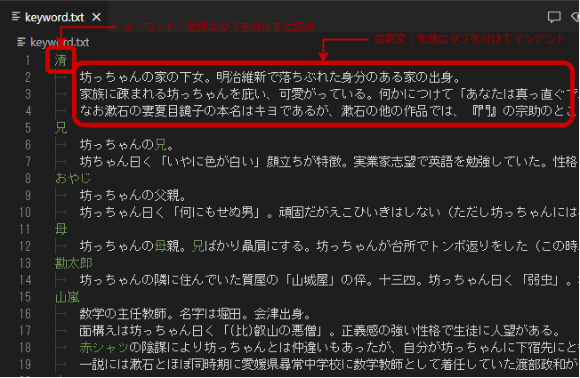

本文中の文字がハイライトされ説明文がポップアップで表示されます。

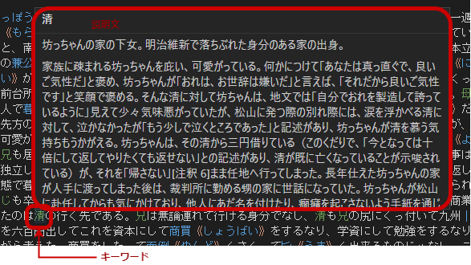

### 3. 縦書きプレビュー

縦書きプレビューは、エディタ内で表示するプレビューとブラウザで表示する２つモードがあります。
1. エディタ内でプレビュー
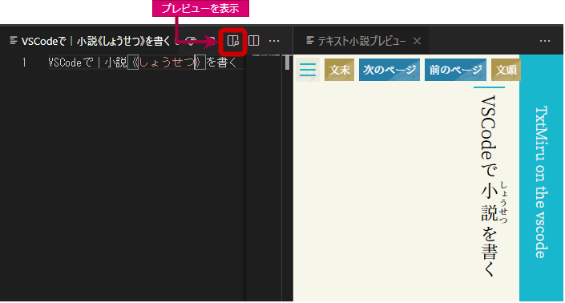

2. ブラウザでプレビュー
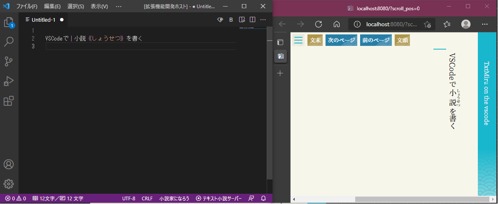

プレビュー用TxtMiruサーバーを本拡張機能内で動かしているため同じネットワーク内であればスマホやiPadなどでも入力中の小説をリアルタイムにプレビューできます。

また、プレビュー画面は「[TxtMiru on the Web](https://gearsns.github.io/TxtMiruOnTheWeb/index.html) 」のエンジンを使用しているため、小説サイトに投稿後の小説もプレビューで表示できます。 
対応サイトは、以下の通り
* [小説家になろう](https://syosetu.com)
* [カクヨム](https://kakuyomu.jp)
* [アルファポリス](https://www.alphapolis.co.jp)
* [ハーメルン](https://syosetu.org)
* [暁](http://www.akatsuki-novels.com/)
* [エブリスタ](https://estar.jp)
* [マグネット](https://www.magnet-novels.com)
* [pixiv](https://www.pixiv.net/novel)
* [青空文庫](https://www.aozora.gr.jp)

### 4. 設定

HTTPサーバーとWebSocketサーバー用のポート番号をデフォルト設定から変更できます。 
既にポート番号が使用されている場合には、こちらから空いているポート番号を指定してください。

### 5. 公開済みの小説を読む

縦書きプレビュー本体は、TxtMiru on the Webをそのまま使用しています。
* 表示された画面のメニューを開き

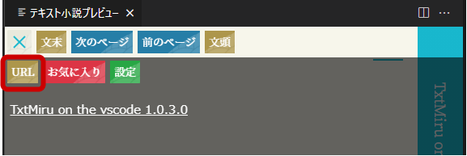
* 「URL」をクリック

* URLを入力して「開く」でWeb上の小説を閲覧できます。

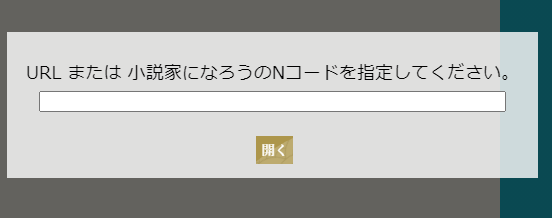

## リリースノート
### 1.0.4

* TxtMiru on the Web 1.0.8.0の修正を反映
	* お気に入り他 閉じるボタン追加
	* 設定 デフォルト設定に戻す機能を追加
	* 文字が長いとメッセージボックスが画面外まではみでる不具合修正
	* お気に入り ソート機能を追加
	* カクヨム 文字揃えCSSを修正
* テキスト変更時のイベントを「テキスト小説用拡張機能」の場合のみチェックするように変更
* ルビ出力形式を「:」、「Tab」、小説ルビ形式から選択できるように変更
